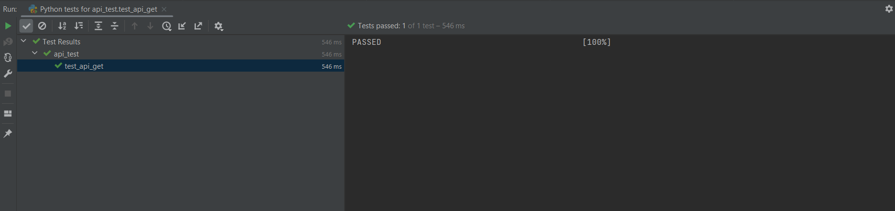

# API Automation
* https://reqres.in/api/users?page=2

This project contains API automations,with following assertions
i. total_pages in response is always equal to 2
ii. status code 200
iii. check email contain "byron.fields@reqres.in"

# Links

* [Github link to clone project](https://github.com/vishnumj005/api-automation)
* please note: the currently used version for python is 3.10.
* Install requirements before executing the scripts
  file before running the script.

# How to run test?

1. Via Terminal

    * Run `pytest <path to test file>`

2. Via PyCharm
    * Run directly from the test file (api_test.py)
   
# Files 

* api_commons.py --> Api common methods like assertions, get value etc
* api_config.py --> All API configurations like api url, status codes etc
* api_requests.py --> Request file contains all api methods like get, post etc 
* api_test.py --> Test File

# Output

